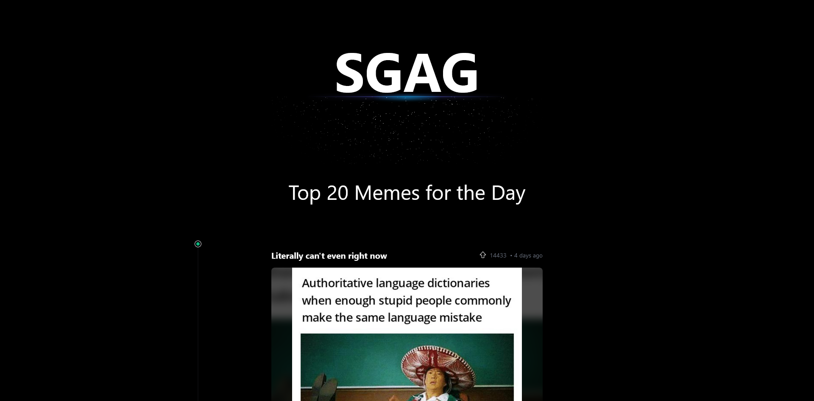

# SGAG Meme Webservice

This is a solution to the hiring assignemnt set out my SGAG media. 

## Table of contents

- [Overview](#overview)
  - [The challenge](#the-challenge)
  - [Screenshot](#screenshot-of-frontend)
  - [Links](#links)
- [Design](#design)
  - [Built with](#built-with)
  - [Running](#running)
  - [End Points](#end-points)
- [Todo](#todo)

## Overview

### The Challenge
The main objectives of it is as follows: 

1. Create a webservice that crawls https://www.reddit.com/r/memes/ and returns top 20 voted posts for the past 24 hours. Sorted by top voted post first, descending order.

2. Stores the crawled data into a database for historical tracking and future data visualization.

3. Present and generate a report file for past 24 hrs top 20 trending memes that can be sent as a file via a Telegram Chatbot.

4. Create a presentation deck to showcase live demo and explain both frontend and backend designs.

5. Suggest 3 alternative use cases or actionable insights from the generated report.

*The full assignment can be found [here](./assignment.txt)*

## Screenshot of Frontend

## Links

- Frontend Only Live Site URL: [here](https://keyule.github.io/SGAG-meme-webservice/)
*Note: The Live Site is hosted with dummy data, to run the full stack application go to [Running](#Running)

# Design

## Built with

- **Front End**
    - React
    - Tailwind CSS
    - Aceternity UI

- **Back End**
    - Node

- **Database**
    - Postgres

- **Telegram Bot**
    - Python
    - [python-telegram-bot](https://python-telegram-bot.org/) 

## Running

- **Without telegram bot**
    1. git clone this repo 
    2. `docker-compose up --build -d`
    3. API sits on port 3000
    4. Web Server sits on port 5173

- **With telegram**
    1. git clone this repo
    2. Register a new Telegram bot via BotFather (see https://core.telegram.org/bots)  
    3. Replace `BOT_TOKEN:` in `docker-compose.yml`
    4. Proceed with step 2 above

## End Points

**API: Port 3000**  

| End Point | Type | Description | Parameters | 
| ----------- |-------------| ----------- | --------------|
| /memes | GET | Returns number of memes based on limit | limit= (max 100) |

## Telegram 
I have no idea what this telegram chat bot is for. But point 3 of the challenge stated that it should be able to generate a file that can be sent in a telegram chatbot. So I added this in. The chatbot just hits the API grabs the memes and sents a PDF file containing the memes. 

| Commands | Description |
| ----------- |-------------| 
| /start | welcomes you |
| /help | Returns available commands |
| /memes | Returns top 5 memes |
| /memefile | Returns top 5 memes in a PDF? |

# Todo

- Add in Redis for fun
- Do up a presentation deck? 